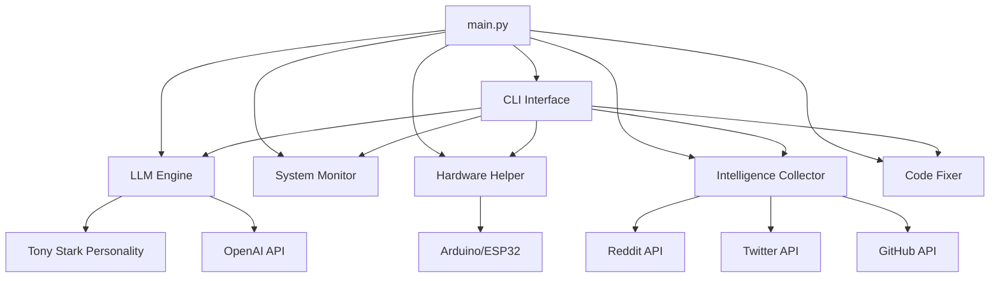

# STARKAI 🤖

**Tony Stark AI Assistant** - A sophisticated AI assistant system with multi-modal capabilities, inspired by Tony Stark's JARVIS.

[](https://python.org)
[](LICENSE)
[]()

## 🚀 Overview

STARKAI is a comprehensive AI assistant that combines natural language processing, hardware control, system monitoring, and intelligent data collection. Built with a Tony Stark personality, it provides a sophisticated interface for interacting with various systems and services.

### ✨ Key Features

- **🧠 LLM Integration** - OpenAI GPT integration with personality-aware responses
- **💬 CLI Interface** - Comprehensive command-line interface with 9 core commands
- **🔧 Hardware Control** - Arduino/ESP32 serial device communication
- **📊 System Monitoring** - Real-time file, process, and system telemetry
- **🌐 Intelligence Collection** - Reddit, Twitter, and GitHub API integration
- **🛠️ Code Analysis** - Automated code fixing and improvement suggestions
- **🎭 Tony Stark Personality** - Character-driven responses and interactions
- **🎤 Voice Interface** - Placeholder for future speech capabilities

## 📋 Requirements

- **Python 3.8+**
- **pip** package manager
- **Serial devices** (optional) - Arduino, ESP32, etc.
- **API Keys** (optional) - OpenAI, Reddit, Twitter, GitHub

## 🛠️ Installation

### 1. Clone the Repository
```bash
git clone https://github.com/pushthev1be/STARKAI.git
cd STARKAI
```

### 2. Install Dependencies
```bash
pip install -r requirements.txt
```

### 3. Configure API Credentials (Optional)
Edit `config/creds.json` with your API keys:
```json
{
  "openai": {
    "api_key": "your-openai-api-key"
  },
  "reddit": {
    "client_id": "your-reddit-client-id",
    "client_secret": "your-reddit-client-secret",
    "user_agent": "STARKAI/1.0"
  },
  "twitter": {
    "bearer_token": "your-twitter-bearer-token"
  },
  "github": {
    "token": "your-github-token"
  }
}
```

## 🚀 Usage

### Starting STARKAI
```bash
python3 main.py
```

### Command Line Options
```bash
python3 main.py --help
python3 main.py --mode cli          # CLI mode (default)
python3 main.py --debug             # Enable debug mode
```

### 💻 CLI Commands

Once STARKAI is running, you can use these commands:

| Command | Description | Example |
|---------|-------------|---------|
| `ask` | Chat with the AI assistant | `ask What's the weather like?` |
| `status` | Show system status | `status` |
| `hardware` | List and control hardware devices | `hardware list` |
| `intel` | Collect intelligence from APIs | `intel reddit python` |
| `fix` | Analyze and fix code files | `fix main.py` |
| `history` | Show command history | `history` |
| `clear` | Clear the screen | `clear` |
| `help` | Show available commands | `help` |
| `quit` | Exit STARKAI | `quit` |

### 🎯 Example Session
```
STARKAI> ask What is your name?
STARKAI: Greetings! I'm STARKAI, your personal AI assistant.

STARKAI> status
=== STARKAI System Status ===
LLM Engine: ✓
Hardware: 0 devices connected
System Monitor: ✓ (tracking 156 processes)
Intelligence Collector: ✓

STARKAI> hardware list
Available serial ports:
- /dev/ttyUSB0 - Arduino Uno (Available)

STARKAI> quit
STARKAI shutting down. Goodbye!
```

## 🏗️ Architecture

### Core Components

```
STARKAI/
├── main.py                 # Application entry point
├── core/                   # Core system modules
│   ├── llm_engine.py      # OpenAI integration
│   ├── personality.py     # Tony Stark personality
│   ├── intel_collector.py # API data collection
│   ├── hardware_helper.py # Serial device control
│   ├── system_hooks.py    # System monitoring
│   └── fixer.py          # Code analysis & fixing
├── interface/             # User interfaces
│   ├── cli.py            # Command-line interface
│   └── voice.py          # Voice interface (placeholder)
├── config/               # Configuration files
│   ├── creds.json       # API credentials
│   └── project.yml      # Project configuration
└── requirements.txt     # Python dependencies
```

### Component Interactions



## ⚙️ Configuration

### Project Configuration (`config/project.yml`)
- Build targets and deployment settings
- Hardware device specifications
- API configuration and requirements
- Feature flags and monitoring settings

### API Credentials (`config/creds.json`)
- **OpenAI**: For LLM responses and chat functionality
- **Reddit**: For collecting posts and comments
- **Twitter**: For social media intelligence
- **GitHub**: For repository analysis and code intelligence

## 🔧 Hardware Integration

STARKAI supports serial communication with various devices:

### Supported Devices
- **Arduino** (Uno, Nano, Mega) - 9600 baud
- **ESP32** (Dev boards, ESP32-CAM) - 115200 baud
- **Raspberry Pi** - GPIO, I2C, SPI communication

### Hardware Commands
```bash
STARKAI> hardware list              # List available devices
STARKAI> hardware connect /dev/ttyUSB0  # Connect to device
STARKAI> hardware send "LED_ON"     # Send command to device
STARKAI> hardware status            # Show device status
```

## 📊 System Monitoring

Real-time monitoring capabilities:
- **Process Tracking** - Monitor running applications
- **File Activity** - Track file system changes
- **System Resources** - CPU, memory, disk usage
- **Network Activity** - Monitor network connections

## 🤖 AI Personality

STARKAI embodies Tony Stark's characteristics:
- **Confident and witty** responses
- **Technical expertise** in explanations
- **Innovative problem-solving** approach
- **Sophisticated communication** style

## 🛠️ Development

### Running Tests
```bash
python3 -m pytest tests/
```

### Code Quality
```bash
flake8 --max-line-length=100 .
black .
```

### Adding New Features
1. Create feature branch: `git checkout -b feature/new-feature`
2. Implement changes in appropriate module
3. Add tests and documentation
4. Submit pull request

## 🔍 Troubleshooting

### Common Issues

**Import Errors**
```bash
pip install -r requirements.txt
```

**Serial Device Not Found**
- Check device permissions: `sudo usermod -a -G dialout $USER`
- Verify device connection: `ls /dev/tty*`

**API Authentication Errors**
- Verify credentials in `config/creds.json`
- Check API key permissions and quotas

**Missing Dependencies**
```bash
pip install --upgrade -r requirements.txt
```

## 📝 License

This project is licensed under the Apache License 2.0 - see the [LICENSE](LICENSE) file for details.

## 🤝 Contributing

1. Fork the repository
2. Create your feature branch (`git checkout -b feature/amazing-feature`)
3. Commit your changes (`git commit -m 'Add amazing feature'`)
4. Push to the branch (`git push origin feature/amazing-feature`)
5. Open a Pull Request

## 📞 Support

- **Issues**: [GitHub Issues](https://github.com/pushthev1be/STARKAI/issues)
- **Discussions**: [GitHub Discussions](https://github.com/pushthev1be/STARKAI/discussions)

## 🎯 Roadmap

- [ ] **Voice Interface** - Speech-to-text and text-to-speech
- [ ] **Web Interface** - Browser-based control panel
- [ ] **Mobile App** - iOS/Android companion app
- [ ] **Cloud Sync** - Multi-device synchronization
- [ ] **Plugin System** - Extensible module architecture
- [ ] **Advanced AI** - Local LLM support and fine-tuning

---

*Built with ❤️ by the STARKAI team*
